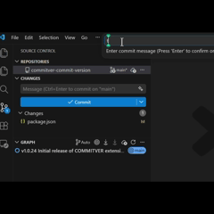
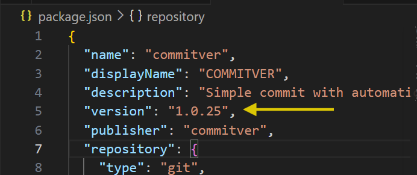
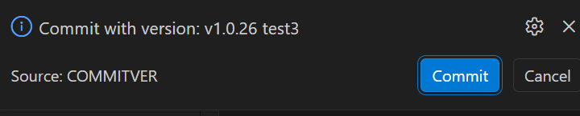
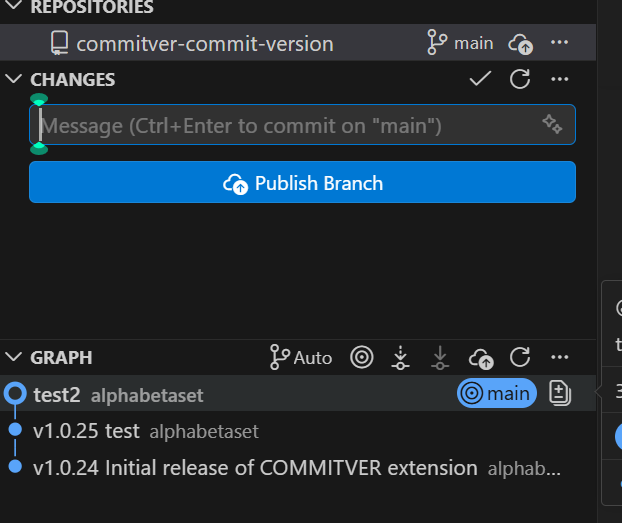

# commitver-commit-version

GitHub commit version extension for Visual Studio Code.

Automatically appends version information to each commit with intelligent version management.


## Features

- **Automatic Versioning**: Automatically increments patch version on each commit
- **Quick Commit**: One-click commit with version tagging
- **Package.json Update**: Automatically updates your project's package.json version
- **Smart Message Formatting**: Formats commit messages as `v1.1.0 Your message`

## How to Use

1:Open your project in VS Code
2:Open Command Palette (`Ctrl+Shift+P` or `Cmd+Shift+P`)
3:Type "Quick Commit with Version" and select it.
4:Enter your commit message.
※This time, type "Enter".
And, This includes version information at the time of commit.



※The version has now been reflected in the packagejson file.




5Confirm the commit with the generated version

Click commit in the notification.


Sending a comment results in an error.


## Example

```text
Input: "Fix bug in authentication"
Output: "v1.1.0 Fix bug in authentication"
```

The extension will:

- Create a git commit with the versioned message
- Update your package.json to version 1.1.0
- Show confirmation of both actions

## Requirements

- Git repository
- package.json in your project root (for version tracking)

## Extension Settings

This extension contributes no settings at this time.

## Release Notes

### 1.1.0

- Migrated repository to goldbash organization
- Updated all repository URLs to organization
- Cleaned up project structure
- Fixed image references for new repository
- Minor version bump for significant changes

### 1.0.26

- Updated repository URLs to personal GitHub account
- Enhanced description for better UX
- Added screenshots for better documentation

### 1.0.25

- Updated repository URLs to personal GitHub account
- Enhanced description for better UX
- Added screenshots for better documentation

### 1.0.24

- Initial release
- Basic version increment functionality
- Package.json integration

## Support

If you encounter any issues or have suggestions, please file an issue on our GitHub repository.

## License

MIT
